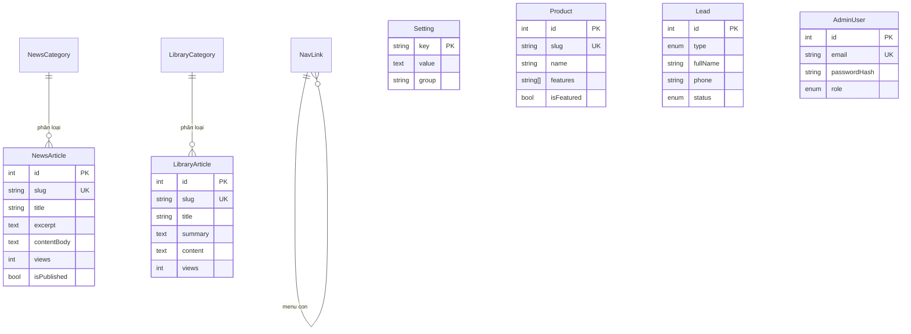

# CSDL BNSC — Kế hoạch chuyển nội dung hardcode sang PostgreSQL

Thư mục này chứa **cấu trúc cơ sở dữ liệu** (PostgreSQL + Prisma) để đưa toàn bộ
nội dung đang hardcode trên website vào DB, làm nền cho **trang admin quản trị**.

| File | Vai trò |
|---|---|
| `schema.prisma` | Định nghĩa toàn bộ bảng/quan hệ (nguồn sự thật). |
| `seed.ts` | Nạp toàn bộ nội dung hiện tại vào DB (idempotent). |
| `docker-compose.yml` | Dịch vụ PostgreSQL 16 cho VPS. |
| `.env.example` | Mẫu biến môi trường `DATABASE_URL`. |
| `migrations/` | (sinh tự động bởi `prisma migrate`) các file SQL. |

---

## 1. Sơ đồ quan hệ (ERD)



**Nhóm bảng:**

- **Nội dung hiển thị** — `settings`, `nav_links`, `hero_slides`, `hero_stats`,
  `products`, `news_categories` / `news_articles`, `library_categories` /
  `library_articles`, `customers`, `consulting_services`, `courses`, `faqs`,
  `support_staff`, `remote_tools`.
- **Dữ liệu vận hành** — `leads` (form đăng ký/tải/tư vấn), `chat_messages`
  (log AI), `media` (tài nguyên upload).
- **Quản trị** — `admin_users` (đăng nhập trang admin).

## 2. Bản đồ: nội dung hiện tại → bảng

> **Nội dung bài viết** (tin tức, thư viện, tư vấn, đào tạo) nay nằm chung ở bảng
> `articles` phân biệt bằng cột `section`. Bộ bảng cũ `news_articles` /
> `library_articles` vẫn còn trong schema để đối chiếu nhưng **không route nào
> đọc nữa** — xem `plan/07-ke-hoach-migration-du-lieu-cu.md`.

| Nguồn hardcode | Bảng |
|---|---|
| `Footer`, `AnnouncementBar`, `server.ts` (prompt AI) | `settings` |
| `src/data.ts` → `navLinks` + `Navbar` dropdown | `nav_links` |
| `Hero.tsx` slides / `src/data.ts` → `heroStats` | `hero_slides` / `hero_stats` |
| `src/data.ts` → `products` | `products` |
| Website cũ bacnam.com.vn (555 bài) → `npm run legacy:import` | `articles` + `categories` + `tags` + `series_nodes` + `redirects` |
| `src/data.ts` → `customersList` | `customers` |
| `ConsultingAndTraining.tsx` → services / courses / faqs | `consulting_services` / `courses` / `faqs (HOME)` |
| `TechnicalSupportPage.tsx` → staff / tools / faqItems | `support_staff` / `remote_tools` / `faqs (SUPPORT)` |
| `InteractiveModal.tsx` (form) | `leads` |

## 3. Triển khai (local & VPS)

> Prisma đã cài sẵn ở **v6** (ổn định, dùng `datasource.url = env(...)`, tương
> thích tốt AdminJS/React-Admin). Các script `db:*` và `prisma.seed` đã có trong
> `package.json`.

```bash
# 1. Bật PostgreSQL
docker compose -f db/docker-compose.yml up -d

# 2. Cấu hình kết nối
cp db/.env.example .env        # sửa DATABASE_URL cho đúng

# 3. Tạo bảng từ schema (sinh migration đầu tiên) + generate client
npm run db:migrate             # prisma migrate dev

# 4. Nạp dữ liệu cấu hình site (hero, sản phẩm, khóa học, FAQ, cấu hình...)
npm run db:seed

# 4b. Nạp 555 bài viết từ website cũ (cần thư mục export + ~2,8 GB ảnh)
npm run legacy:mirror          # tải ảnh về public/uploads/legacy
npm run legacy:import          # nạp bài + danh mục + thẻ + mục lục + redirect

# 5. Xem/sửa dữ liệu nhanh bằng GUI có sẵn của Prisma
npm run db:studio
```

> Trên VPS/production dùng `npm run db:deploy` (`prisma migrate deploy` – áp dụng
> migration đã commit, không tạo mới).

### Cách 2 — `db/schema.sql` trong pgAdmin (chỉ khi máy không có Node)

`db/schema.sql` là **DDL thuần được sinh tự động từ `schema.prisma`** — không
sửa tay, không chứa dữ liệu.

1. pgAdmin → chọn/tạo database đích → **Query Tool**.
2. Mở `db/schema.sql` → **Execute/Run (F5)**. Sau đó vẫn phải chạy
   `npm run db:seed` (+ `legacy:import`) ở nơi khác để có dữ liệu.

> ⚠️ Cách này **không** ghi bảng `_prisma_migrations`, nên `npm run db:deploy`
> chạy sau sẽ báo lệch. Trên máy chủ luôn dùng Cách 1.

Sinh lại khi schema đổi:

```bash
npx prisma migrate diff   --from-empty --to-schema-datamodel db/schema.prisma   --script > db/schema.sql
```

> pgAdmin vẫn rất hữu ích để **xem/truy vấn dữ liệu** — chỉ đừng dùng nó để tạo
> hay sửa cấu trúc bảng, vì cấu trúc chỉ có một nguồn: `db/schema.prisma`.

## 4. Vận hành (ĐÃ TRIỂN KHAI)

Website đã đọc dữ liệu từ DB qua API, và có sẵn trang admin.

### API (Express + Prisma)
- `GET /api/public/*` — dữ liệu công khai cho site (settings, nav, hero, products,
  news, library, consulting, faqs, customers, support). Frontend gọi qua
  `src/lib/api.ts` với **fallback dữ liệu tĩnh** cho phần cấu hình (mất DB vẫn
  không trắng trang). Tin tức/thư viện không có fallback tĩnh — hiện trạng thái
  trống, vì nội dung thật chỉ có trong CSDL.
- `GET /api/public/articles` (+ `/:slug`, `/categories`, `/tags`, `/series`) —
  nội dung hợp nhất, có phân trang/tìm kiếm/lọc phía máy chủ.
- `GET /sitemap.xml` — sinh động từ CSDL (không còn file tĩnh).
- `POST /api/public/leads` — nhận form Tải/Đăng ký/Tư vấn từ modal.
- `POST /api/admin/auth/login|logout` + `GET /me` — đăng nhập admin (JWT trong
  cookie httpOnly + bcrypt).
- `/api/admin/resources/:resource` (+ `/:id`) — CRUD generic, yêu cầu đăng nhập.

### Trang admin
- Truy cập **`/admin`** (đăng nhập tại `/admin/login`). Giao diện quản trị toàn
  bộ: tin tức, thư viện, sản phẩm, hero, khách hàng, tư vấn/khóa học, FAQ, hỗ
  trợ, menu, danh mục, cấu hình site, **lead**, tài khoản admin.
- Tạo admin đầu tiên:
  ```bash
  npm run db:create-admin -- admin@bacnam.com.vn "MatKhauManh123" "Quản trị viên"
  ```
- Đặt biến môi trường **`JWT_SECRET`** (chuỗi ngẫu nhiên dài) trong `.env`.

### Trình tự triển khai đầy đủ trên VPS
```bash
npm ci
docker compose -f db/docker-compose.yml up -d      # PostgreSQL
cp db/.env.example .env                             # sửa DATABASE_URL + JWT_SECRET + APP_URL
npm run db:deploy                                    # tạo bảng (prisma migrate deploy)
npm run db:seed                                      # dữ liệu cấu hình site
npm run legacy:mirror                                # tải ảnh bài viết cũ (~2,8 GB)
npm run legacy:import                                # nạp 555 bài viết
npm run db:create-admin -- admin@bacnam.com.vn "MatKhau" "Admin"
npm run build                                        # prisma generate + vite + server
NODE_ENV=production npm start
```
> `npm run build` cần Prisma Client đã generate. Nếu chưa, chạy `npm run db:generate`.

## 5. Ghi chú thiết kế

- `dateText` giữ nguyên chuỗi ngày đang hiển thị; `publishedAt` (DateTime) để
  sắp xếp/lọc chuẩn — nên điền dần và chuyển UI sang dùng `publishedAt`.
- `articles.contentHtml` giữ HTML đã sanitize (allowlist), `contentText` là bản
  text thuần dùng cho tìm kiếm và sinh tóm tắt.
- Ảnh Hero đang là asset bundle; seed dùng đường dẫn `/uploads/hero/...` —
  cần upload lại 2 ảnh này vào thư mục tĩnh của server.
- `isActive` / `isPublished` cho phép ẩn/hiện mà không xóa dữ liệu.
- `sortOrder` quyết định thứ tự hiển thị (menu, slide, sản phẩm, khách hàng...).
